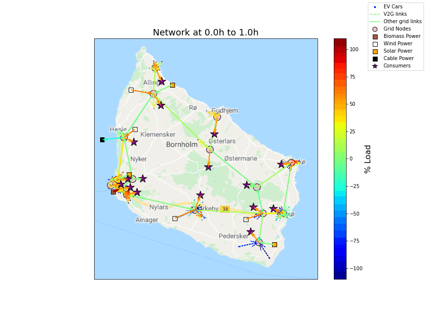

# Optimal Scheduling of Bi-directional Electric Cars

This is the repository belonging to the report of the same name for the AE4441-16 course "Operations Optimization" at TU Delft, Aerospace Engineering, Control and Operations Master.

To run, download the repo and run complex.py from its working directory. Observer command line output and the plots in ./plots/

Basic simulation settings can be changed in ./Lib/SimConfig.py.

Additional scripts, mainly for verification, post-processing of LP files, and clustering of the output are in the root folder. Library files and functions in ./Lib/ are never supposed to be run by themselves; the need to be imported from the ./ working directory using, for instance:
''' from Lib import cars_gen as cg'''

# Python Configuration and Modules

## Additional general purpose python modules

For visualization. What is supposed to work:
'''
conda install numpy scipy matplotlib pandas networkx seaborn
conda install -c conda-forge cartopy
'''

What worked on my Linux distro
'''
conda install numpy scipy matplotlib pandas networkx
conda install geos cython shapely pyshp six
conda install "proj4<5"

\# then build from source like it's the 90s:
git clone https://github.com/SciTools/cartopy.git
cd cartopy
python setup.py install
'''

## Install Gurobi: we only need to install the python module (note: if you're a pip guy, see https://www.gurobi.com/documentation/9.1/quickstart_linux/cs_using_pip_to_install_gr.html):
1. Get Anaconda (or just conda, as you prefer) for your operating system --> 64bit only!
2. From the Anaconda windows, open a "CMD.exe Prompt"
3. Execute the following commands:
    1. conda config --add channels http://conda.anaconda.org/gurobi
    2. conda install gurobi
        1. give it some time and confirm any questions with "y [enter]"
        2. you should see it finish with   
           - Preparing transaction: done
           - Verifying transaction: done
           - Executing transaction: done
    3. keep this windows open
4. Activate license
    1. click on the lowest license (if there are multiple) at https://www.gurobi.com/downloads/licenses/
    2. Copy the command at the "Installation" section
        1. it should look like "grbgetkey abcdef00-1234-1234-12af-0123456789ab"
    3. Execute it in the "CMD.exe Prompt" window of the previous steps
        1. you should see something like   
           "info  : License 567890 written to file /home/tblaha/gurobi.lic"
5. Test
    1. Open Spyder from Anaconda
    2. In the console window, type "import gurobipy"
        1. this should not produce any errors
        
### *NOT NEEDED* Install standalone-Gurobi
1. Make accademic account at https://www.gurobi.com/downloads/end-user-license-agreement-academic/
2. Log in to your account
3. Download GUROBI 9.1.0 at https://www.gurobi.com/downloads/gurobi-optimizer-eula/
    1. If your on Windows, download the .msi
4. To install, follow the steps at https://packages.gurobi.com/9.1/README.txt
5. Then, request license at https://www.gurobi.com/downloads/end-user-license-agreement-academic/
6. Activate license
    1. click on the lowest license (if there are multiple) at https://www.gurobi.com/downloads/licenses/
    2. Follow the instructions at the "Installation" section
        1. I cannot verify this for windows

